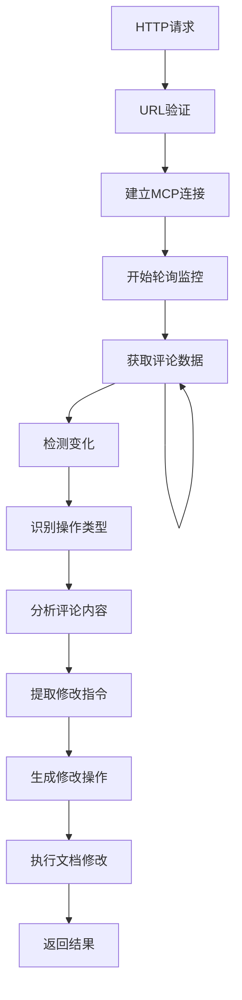

# 飞书文档评论监控服务 - 产品需求文档

## 1. Product Overview

飞书文档评论监控服务是一个基于Node.js的HTTP服务，作为MCP（Model Context Protocol）客户端，通过轮询机制实时监控飞书文档的评论变化，并根据不同的评论操作执行相应的处理逻辑。该服务实现了一个零侵入的飞书文档agent，用户可以直接在飞书文档上发表评论来触发文档修改操作，无需额外的操作界面或工具。

* 该服务解决了飞书文档评论变化实时监控的需求，为开发者和团队提供自动化的评论管理能力，并通过复用飞书文档的评论功能实现文档内容的智能修改。

* 目标用户是需要对飞书文档进行自动化处理的开发团队和企业用户，特别是希望通过简单评论就能修改文档内容的用户。

## 2. Core Features

### 2.1 User Roles

由于该服务主要面向开发者和系统集成，不需要复杂的用户角色区分。

### 2.2 Feature Module

我们的飞书文档评论监控服务包含以下主要功能模块：

1. **HTTP接口服务**：接收包含飞书文档URL的HTTP请求，启动监控任务。
2. **MCP客户端连接**：使用langchainjs和mcp-adapters连接到指定的stdio MCP server。
3. **评论轮询监控**：通过MCP server提供的工具定期获取文档评论数据。
4. **评论变化检测**：识别评论的增加、删除、编辑、标记解决等操作。
5. **评论内容解析**：分析评论内容，识别用户意图和修改指令。
6. **文档修改执行**：根据评论中的指令，使用MCP server的工具执行文档修改操作。
7. **操作处理执行**：根据不同的评论操作类型执行相应的处理逻辑。

### 2.3 Page Details

| Page Name | Module Name | Feature description                                     |
| --------- | ----------- | ------------------------------------------------------- |
| HTTP接口服务  | 请求接收模块      | 接收GET请求，解析URL参数中的飞书文档地址，验证URL格式，返回监控状态                  |
| HTTP接口服务  | 响应处理模块      | 返回JSON格式的响应，包含监控任务状态、错误信息等                              |
| MCP客户端连接  | 连接管理模块      | 使用langchainjs和mcp-adapters建立与stdio MCP server的连接，管理连接状态 |
| MCP客户端连接  | 工具调用模块      | 调用MCP server提供的评论获取、处理等工具，处理工具调用结果                      |
| 评论轮询监控    | 轮询调度模块      | 定时调用MCP server的轮询工具，获取最新的评论数据                           |
| 评论轮询监控    | 数据缓存模块      | 缓存历史评论数据，用于变化对比和检测                                      |
| 评论变化检测    | 差异分析模块      | 对比新旧评论数据，识别增加、删除、编辑、标记解决等操作类型                           |
| 评论变化检测    | 事件生成模块      | 根据检测到的变化生成相应的事件对象，包含操作类型和详细信息                           |
| 评论内容解析    | 意图识别模块      | 分析评论内容，识别用户的修改意图和具体指令                                   |
| 评论内容解析    | 指令提取模块      | 从评论中提取具体的修改指令，包括修改位置、内容和格式要求                            |
| 文档修改执行    | 修改生成模块      | 根据提取的指令生成具体的文档修改操作                                       |
| 文档修改执行    | 修改应用模块      | 调用MCP server的工具将修改应用到飞书文档                               |
| 操作处理执行    | 策略路由模块      | 根据评论操作类型路由到不同的处理策略                                      |
| 操作处理执行    | 工具执行模块      | 调用MCP server的相关工具执行具体的处理操作                              |

## 3. Core Process

### 主要用户操作流程

#### 服务启动流程

1. 用户发送HTTP GET请求到服务端点，URL参数包含飞书文档地址
2. 服务验证文档URL格式并建立MCP连接
3. 服务开始轮询获取文档评论数据

#### 评论处理流程

1. 系统检测评论变化并识别操作类型（新增、编辑、删除、标记解决等）
2. 对于新增评论，分析评论内容并识别用户修改意图
3. 从评论中提取具体的修改指令
4. 根据指令生成文档修改操作
5. 调用MCP server工具执行文档修改
6. 返回修改结果，可能通过回复评论的方式

#### 零侵入式用户体验流程

1. 用户在飞书文档中添加评论，描述需要进行的修改
2. 系统自动检测到新评论并分析内容
3. 系统执行相应的文档修改操作
4. 用户可以在文档中直接看到修改结果
5. 系统可能通过回复评论的方式确认修改完成

## 4. User Interface Design

### 4.1 Design Style

由于这是一个后端HTTP服务，主要通过API接口提供服务，不涉及用户界面设计。

* API响应格式：JSON

* 错误处理：标准HTTP状态码

* 日志格式：结构化日志

### 4.2 Page Design Overview

| Page Name | Module Name | UI Elements                                  |
| --------- | ----------- | -------------------------------------------- |
| HTTP接口服务  | API响应       | JSON格式响应，包含status、message、data字段，使用标准HTTP状态码 |
| 日志输出      | 控制台日志       | 结构化日志格式，包含时间戳、级别、消息、上下文信息                    |

