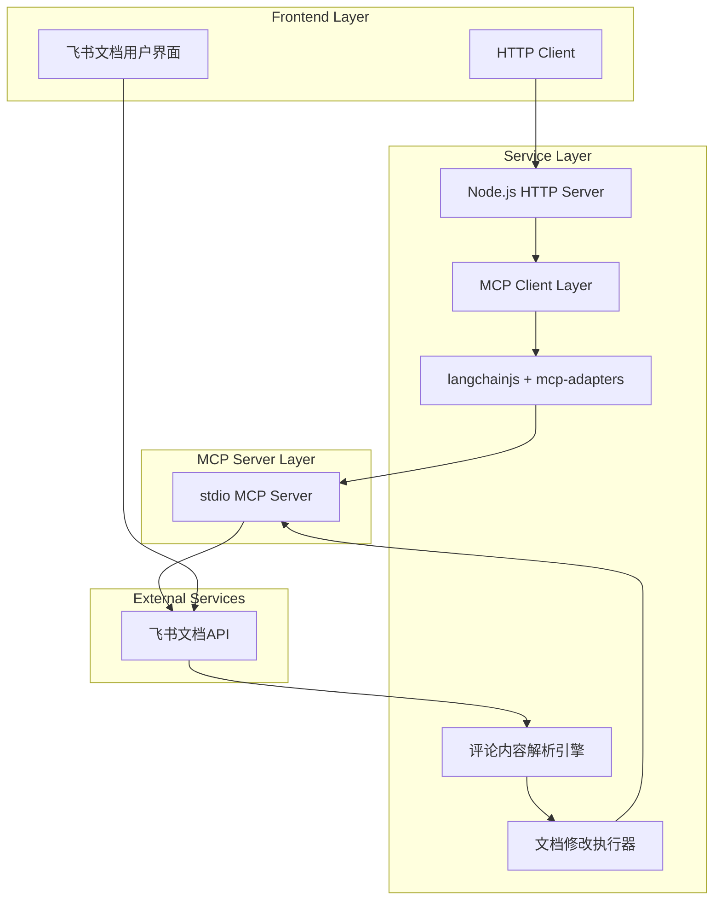
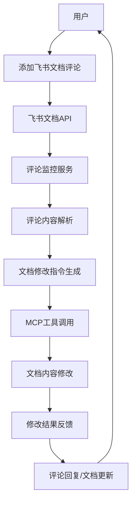
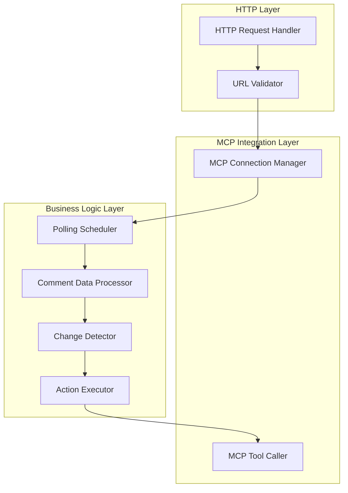

# 飞书文档评论监控服务 - 技术架构文档

## 1. Architecture design



### 零侵入式文档修改架构



## 2. Technology Description

* Frontend: 
  * HTTP Client (任何支持HTTP请求的客户端)
  * 飞书文档用户界面 (用户直接在飞书文档中添加评论)

* Backend: 
  * Node.js\@18+ + Express\@4 + langchainjs + mcp-adapters
  * 评论内容解析引擎 (基于NLP技术分析评论内容)
  * 文档修改执行器 (将解析后的指令转换为文档修改操作)

* MCP Server: stdio MCP Server (外部提供)
  * 提供评论获取工具
  * 提供文档修改工具
  * 提供评论回复工具

* External API: 飞书文档API
  * 评论API
  * 文档内容API

## 3. Route definitions

| Route                     | Purpose              |
| ------------------------- | -------------------- |
| GET /?url={document\_url} | 启动飞书文档评论监控，接收文档URL参数 |
| GET /status               | 查询当前监控任务状态           |
| POST /stop                | 停止指定文档的监控任务          |
| GET /health               | 服务健康检查端点             |

## 4. API definitions

### 4.1 Core API

#### 启动监控

```
GET /?url={document_url}
```

Request:

| Param Name | Param Type | isRequired | Description  |
| ---------- | ---------- | ---------- | ------------ |
| url        | string     | true       | 飞书文档的完整URL地址 |

Response:

| Param Name  | Param Type | Description            |
| ----------- | ---------- | ---------------------- |
| status      | string     | 请求处理状态 (success/error) |
| message     | string     | 响应消息                   |
| taskId      | string     | 监控任务ID                 |
| documentUrl | string     | 被监控的文档URL              |

Example Request:

```
GET /?url=https://gcn8oibd0q4p.feishu.cn/docx/Nk6WdImZKo26ykxE49AcSnwon8d
```

Example Response:

```json
{
  "status": "success",
  "message": "监控任务已启动",
  "taskId": "task_12345",
  "documentUrl": "https://gcn8oibd0q4p.feishu.cn/docx/Nk6WdImZKo26ykxE49AcSnwon8d"
}
```

#### 查询状态

```
GET /status?taskId={task_id}
```

Request:

| Param Name | Param Type | isRequired | Description |
| ---------- | ---------- | ---------- | ----------- |
| taskId     | string     | true       | 监控任务ID      |

Response:

| Param Name   | Param Type | Description                  |
| ------------ | ---------- | ---------------------------- |
| status       | string     | 任务状态 (running/stopped/error) |
| taskId       | string     | 任务ID                         |
| documentUrl  | string     | 监控的文档URL                     |
| lastPollTime | string     | 最后轮询时间                       |
| commentCount | number     | 当前评论总数                       |

## 5. Server architecture diagram



## 6. Data model

### 6.1 Data model definition

```mermaid
erDiagram
    MONITORING_TASK ||--o{ COMMENT_SNAPSHOT : tracks
    COMMENT_SNAPSHOT ||--o{ COMMENT_CHANGE : generates
    COMMENT_CHANGE ||--o{ COMMENT_INTENT : analyzed_into
    COMMENT_INTENT ||--o{ DOCUMENT_MODIFICATION : generates
    DOCUMENT_MODIFICATION ||--o{ ACTION_EXECUTION : triggers
    
    MONITORING_TASK {
        string taskId PK
        string documentUrl
        string status
        datetime createdAt
        datetime lastPollTime
        int pollInterval
    }
    
    COMMENT_SNAPSHOT {
        string snapshotId PK
        string taskId FK
        json commentData
        datetime timestamp
        int commentCount
    }
    
    COMMENT_CHANGE {
        string changeId PK
        string snapshotId FK
        string changeType
        string commentId
        json changeData
        datetime detectedAt
    }
    
    COMMENT_INTENT {
        string intentId PK
        string changeId FK
        string intentType
        json parsedContent
        json modificationInstructions
        datetime analyzedAt
    }
    
    DOCUMENT_MODIFICATION {
        string modificationId PK
        string intentId FK
        string modificationType
        json targetLocation
        json modificationContent
        datetime generatedAt
    }
    
    ACTION_EXECUTION {
        string executionId PK
        string modificationId FK
        string actionType
        string mcpTool
        json parameters
        string result
        datetime executedAt
    }
```



### 6.2 Data Definition Language

由于这是一个内存型服务，主要使用JavaScript对象存储运行时数据，不需要持久化数据库。以下是主要数据结构的TypeScript定义：

```typescript
// 监控任务
interface MonitoringTask {
  taskId: string;
  documentUrl: string;
  status: 'running' | 'stopped' | 'error';
  createdAt: Date;
  lastPollTime?: Date;
  pollInterval: number; // 轮询间隔（毫秒）
}

// 评论快照
interface CommentSnapshot {
  snapshotId: string;
  taskId: string;
  commentData: Comment[];
  timestamp: Date;
  commentCount: number;
}

// 评论对象
interface Comment {
  id: string;
  content: string;
  author: string;
  createdAt: Date;
  updatedAt?: Date;
  status: 'active' | 'resolved' | 'deleted';
  parentId?: string; // 回复评论的父评论ID
}

// 评论变化
interface CommentChange {
  changeId: string;
  snapshotId: string;
  changeType: 'added' | 'deleted' | 'edited' | 'resolved' | 'reopened';
  commentId: string;
  changeData: any;
  detectedAt: Date;
}

// 评论意图
interface CommentIntent {
  intentId: string;
  changeId: string;
  intentType: 'modify_content' | 'add_content' | 'delete_content' | 'format_content' | 'other';
  parsedContent: any; // 解析后的评论内容
  modificationInstructions: any; // 修改指令
  analyzedAt: Date;
}

// 文档修改
interface DocumentModification {
  modificationId: string;
  intentId: string;
  modificationType: 'insert' | 'update' | 'delete' | 'format';
  targetLocation: {
    paragraph?: number;
    line?: number;
    section?: string;
    selector?: string; // CSS选择器或其他定位方式
  };
  modificationContent: {
    originalText?: string;
    newText?: string;
    formatInstructions?: any;
  };
  generatedAt: Date;
}

// 操作执行记录
interface ActionExecution {
  executionId: string;
  modificationId: string; // 关联到文档修改而不是直接关联到评论变化
  actionType: string;
  mcpTool: string;
  parameters: Record<string, any>;
  result: string;
  executedAt: Date;
}

// MCP工具调用配置
interface MCPToolConfig {
  toolName: string;
  description: string;
  parameters: Record<string, any>;
}
```

### 内存存储初始化

```javascript
// 全局存储对象
const globalStore = {
  tasks: new Map(), // taskId -> MonitoringTask
  snapshots: new Map(), // snapshotId -> CommentSnapshot
  changes: new Map(), // changeId -> CommentChange
  intents: new Map(), // intentId -> CommentIntent
  modifications: new Map(), // modificationId -> DocumentModification
  executions: new Map(), // executionId -> ActionExecution
  mcpConnection: null, // MCP连接实例
};

// 初始化存储
function initializeStore() {
  console.log('Initializing in-memory data store...');
  // 清理过期任务的定时器可以在这里设置
}

// 评论内容解析引擎初始化
function initializeCommentParser() {
  console.log('Initializing comment parser engine...');
  // 初始化NLP模型或规则引擎
}

// 文档修改执行器初始化
function initializeDocumentModifier() {
  console.log('Initializing document modifier...');
  // 初始化文档修改工具
}
```

